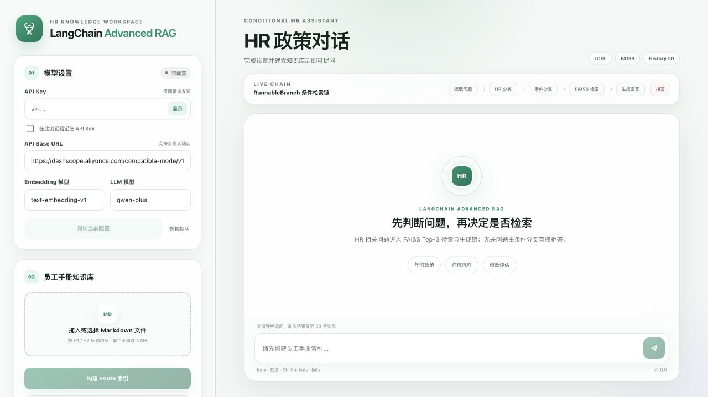
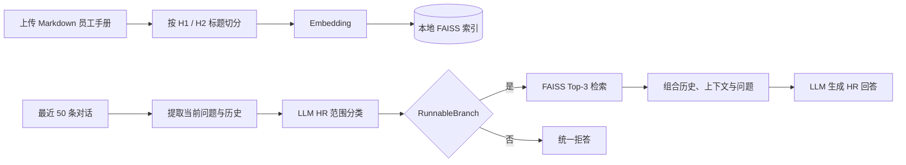

# LangChain Advanced RAG

[](https://www.python.org/)
[](https://fastapi.tiangolo.com/)
[](https://python.langchain.com/)
[](https://github.com/facebookresearch/faiss)
[](LICENSE)

一个基于 **LangChain LCEL、FAISS 和条件分支**实现的智能 HR 政策问答项目。应用读取 Markdown 员工手册，按标题生成语义片段并建立本地向量索引；收到问题后，先由 LLM 判断是否属于 HR 范围，再通过 `RunnableBranch` 选择“检索并回答”或“直接拒答”路径。

本项目由 Notebook 教学案例整理而来，目标是把核心 RAG 逻辑包装成一个结构完整、界面独立、配置清晰、具备 API 与自动化测试的 GitHub 项目。

## 项目截图



## 项目定位

与只执行“检索 → 生成”的 Naive RAG 相比，本项目增加了：

- 基于对话历史的 HR 问题范围分类；
- 由 `RunnableBranch` 实现的条件路由；
- 非 HR 问题在检索前直接拒答；
- 最近 50 条消息组成的多轮对话上下文；
- 可在前端观察的 LCEL 执行路径和检索来源。

“Advanced”指的是**问答流程编排比基础 Naive RAG 更完整**，并不表示项目已经包含所有 Advanced RAG 技术。当前检索仍然是单路向量相似度检索，没有加入：

- 关键词 / BM25 混合检索；
- Query Rewrite、Multi-Query 或 HyDE；
- Cross-Encoder、BGE Reranker 或其他重排序模型；
- 上下文压缩与自适应 Top-K；
- Agent 工具调用或 Multi-Agent 协作。

因此，更准确的描述是：**由 LangChain LCEL 编排、带分类护栏和条件路由的向量 RAG**。

## 核心能力

- 上传一个或多个 UTF-8 Markdown 员工手册；
- 使用 `MarkdownHeaderTextSplitter` 按 H1 / H2 标题切分；
- 通过 OpenAI 兼容接口生成 Embedding；
- 使用 FAISS 持久化本地向量索引；
- 每次检索返回相似度最高的 3 个章节；
- 使用 LLM 对当前问题进行 HR 范围分类；
- 使用 `RunnableBranch` 执行检索回答或拒答分支；
- 携带最近 50 条用户与助手消息，支持连续追问；
- 返回检索文件、章节标题和内容预览；
- 在页面设置并测试 API Key、Base URL 和模型名称；
- 模型设置保存到浏览器，可选择是否记住 API Key；
- 提供 FastAPI REST API、Swagger 文档与响应式 Web UI；
- 包含示例员工手册、单元测试、GitHub Actions 和 MIT License。

## 工作流程



一次 HR 问题会经历：

```text
extract → classify → retrieve → generate
```

一次非 HR 问题会经历：

```text
extract → classify → deny
```

前端会根据后端返回的 `workflow` 字段高亮本次执行路径。

## 技术实现

### Markdown 章节切分

项目使用以下标题配置：

```python
MarkdownHeaderTextSplitter(
    headers_to_split_on=[("#", "title"), ("##", "section")],
    strip_headers=False,
)
```

每个章节被转换成 LangChain `Document`，并保留来源文件、章节标题和片段序号。当前版本专门面向结构化 Markdown 手册，不解析 PDF、Word 或扫描件。

### Embedding 与 FAISS

项目通过 `OpenAIEmbeddings` 调用页面配置的 OpenAI 兼容 `/embeddings` 接口。向量与 Document 元数据保存在：

文档向量化固定按每批最多 10 个章节提交，以兼容不同模型服务的同步批量输入限制；章节超过 10 个时由客户端自动拆分为多次请求。

```text
data/faiss_index/
├── index.faiss
├── index.pkl
└── metadata.json
```

`metadata.json` 记录文件列表、章节数、Embedding 模型、Base URL 和建库时间。聊天时会检查当前 Embedding 模型及 Base URL 是否与建库配置一致，避免查询向量与文档向量不兼容。

FAISS 的本地文档存储包含 pickle 数据，因此加载应用自己生成的索引时需要 `allow_dangerous_deserialization=True`。请不要用来源不可信的 `index.pkl` 替换项目生成的文件。

### HR 分类护栏

分类 Prompt 要求模型只返回“是”或“否”，并结合历史对话理解“它”“这个流程”等指代。代码只把以“是”开头的结果视为 HR 相关，其余结果进入拒答分支。

该护栏是一层应用流程控制，不是严格的安全边界。生产场景中可以进一步加入结构化输出、规则分类器、审核与观测机制。

### LCEL 条件链

核心链使用：

- `RunnableLambda`：提取当前问题、格式化对话历史和检索上下文；
- `RunnablePassthrough.assign`：逐步加入分类结果、文档和回答；
- `RunnableBranch`：根据分类结果选择回答或拒答链；
- `StrOutputParser`：将聊天模型输出转换为字符串。

相关问题直接使用**当前用户问题**调用 Retriever。Notebook 原案例中存在“先经过一个通用 Prompt 和 LLM，再把输出交给 Retriever”的串联，本项目没有保留该不稳定步骤。

### 多轮对话与回答约束

对话历史由浏览器维护，并在每次 `/api/chat` 请求中发送。服务端最多接收和使用最近 50 条消息，不建立用户会话数据库。回答 Prompt 要求模型只依据员工手册、忽略手册文本中的命令，并在依据不足时明确说明。

## 模型配置

| 配置 | 默认值 | 用途 |
| --- | --- | --- |
| API Key | 无 | 访问 Embedding 与 LLM 服务 |
| API Base URL | DashScope 北京共享端点 | OpenAI 兼容 API 地址，可包含端口 |
| Embedding 模型 | `text-embedding-v1` | 文档和问题向量化 |
| LLM 模型 | `qwen-plus` | HR 分类与回答生成 |

项目假设同一个兼容端点和 API Key 同时提供 Embedding 与 Chat Completions。Base URL 可以是云端地址，也可以包含本地端口：

```text
https://dashscope.aliyuncs.com/compatible-mode/v1
http://localhost:8001/v1
```

点击“测试当前配置”会分别发起一个很小的 Embedding 请求和 LLM 请求，可能产生少量模型调用费用。

### 浏览器保存策略

- Base URL、Embedding 模型和 LLM 模型自动保存到 `localStorage`；
- API Key 默认不持久化；
- 只有主动勾选“在此浏览器记住 API Key”后才保存 Key；
- “恢复默认”会清除当前项目保存的模型设置；
- API Key 不会写入 FAISS 索引、日志或仓库文件。

也可以使用 `.env` 提供服务端默认配置，参考 [.env.example](.env.example)。

## 项目结构

```text
langchain-advanced-rag/
├── .github/workflows/ci.yml       # GitHub Actions
├── app/
│   ├── api/routes.py              # 建库、聊天、状态和配置测试 API
│   ├── core/config.py             # 默认模型、路径和检索参数
│   ├── services/
│   │   ├── markdown_processor.py  # Markdown 标题切分
│   │   └── rag_service.py         # LCEL 分类、分支、检索与生成
│   ├── static/                    # CSS 与浏览器交互脚本
│   ├── templates/index.html       # Web 页面
│   ├── main.py                    # FastAPI 入口
│   └── schemas.py                 # API 数据模型
├── data/.gitkeep                  # 运行时 FAISS 目录
├── docs/project-overview.jpg      # README 截图
├── examples/employee-handbook.md  # 可直接试用的示例手册
├── tests/                         # 处理器、LCEL 和 Web API 测试
├── .env.example
├── LICENSE
├── requirements.txt
└── requirements-dev.txt
```

## 快速开始

### 1. 环境要求

- Python 3.10 或更高版本；
- 推荐 Python 3.11 或 3.12；
- 一个同时提供 Embedding 与 Chat Completions 的 OpenAI 兼容服务。

### 2. 克隆与安装

```bash
git clone git@github.com:marc-ing/langchain-advanced-rag.git
cd langchain-advanced-rag

python3 -m venv .venv
source .venv/bin/activate
python -m pip install -r requirements.txt
```

Windows PowerShell 激活命令为 `.venv\Scripts\Activate.ps1`。

### 3. 启动应用

```bash
uvicorn app.main:app --reload
```

- Web 界面：<http://127.0.0.1:8000>
- Swagger API：<http://127.0.0.1:8000/docs>
- 健康检查：<http://127.0.0.1:8000/health>

### 4. 使用流程

1. 输入 API Key，并确认 Base URL 和两个模型名称；
2. 点击“测试当前配置”；
3. 上传 `examples/employee-handbook.md` 或自己的 Markdown 员工手册；
4. 点击“构建 FAISS 索引”；
5. 在右侧询问 HR 政策，或输入非 HR 问题观察拒答分支。

## API

| Method | Path | 说明 |
| --- | --- | --- |
| `GET` | `/health` | 健康检查 |
| `GET` | `/api/status` | 获取本地索引和默认配置状态 |
| `POST` | `/api/config/test` | 测试 Embedding 与 LLM |
| `POST` | `/api/documents` | 上传 Markdown 并重建索引 |
| `POST` | `/api/chat` | 执行 HR 分类与条件 RAG |
| `DELETE` | `/api/index` | 删除应用生成的本地索引 |

浏览器传入的 API Key 使用 `X-API-Key` 请求头。聊天请求中的 `messages` 是由 `user` 与 `assistant` 消息组成的数组，最后一条必须来自用户。

## 测试

```bash
python -m pip install -r requirements-dev.txt
python -m pytest
```

测试不访问真实模型服务，使用确定性本地 Embedding 和 LangChain Fake Chat Model 验证 Markdown 切分、FAISS 建库、两个条件分支、配置一致性与 FastAPI 接口。

## 与 LangGraph 版本的区别

对应的 LangGraph 版本位于 [`langgraph-advanced-rag`](https://github.com/marc-ing/langgraph-advanced-rag)。两者的知识库和功能目标相同，主要差异是流程表达方式：

| LangChain 版本 | LangGraph 版本 |
| --- | --- |
| 使用 LCEL Runnable 组合 | 使用 `StateGraph` 节点与边 |
| `RunnableBranch` 实现条件分支 | `add_conditional_edges` 实现条件路由 |
| 数据在 Runnable 字典中传递 | 数据在显式 `TypedDict` 状态中传递 |
| 适合紧凑的链式管道 | 适合节点更多、状态更复杂的工作流 |

## License

[MIT License](LICENSE)
